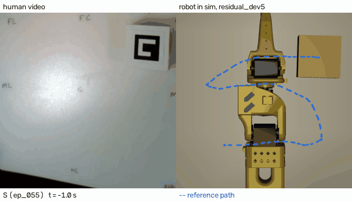
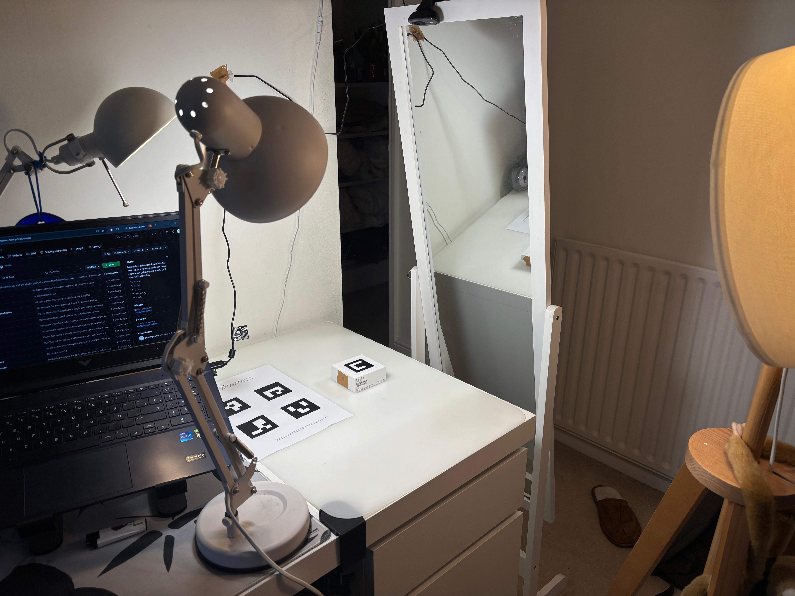
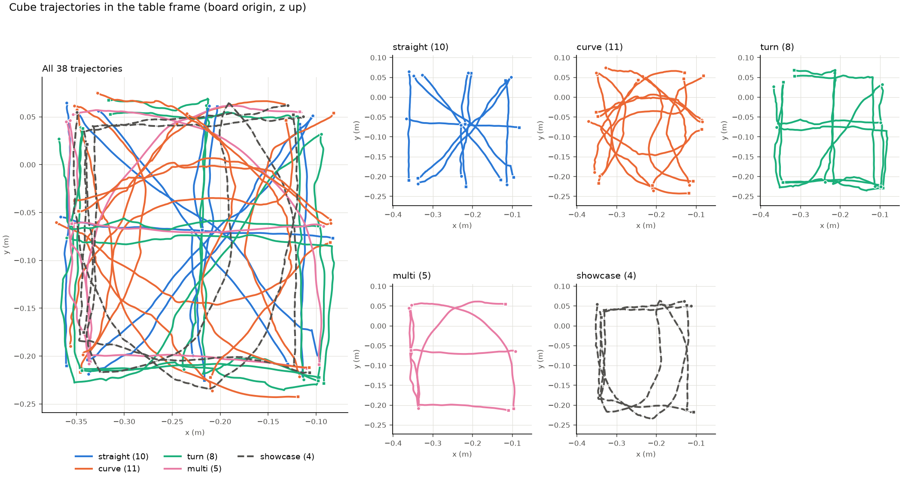
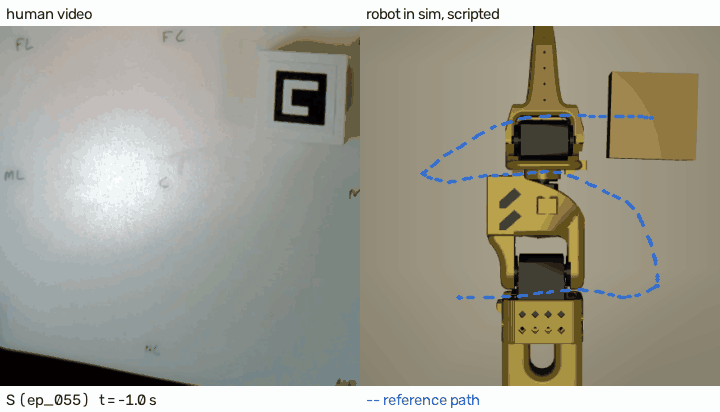
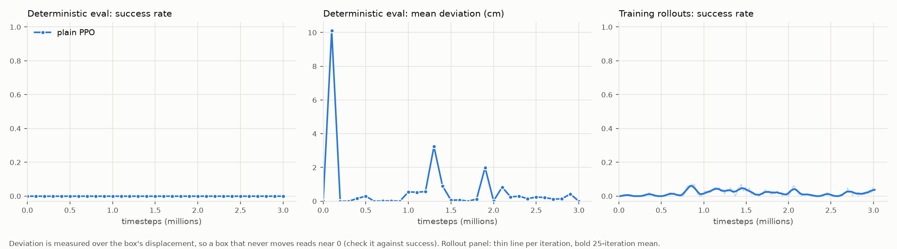

# Where, not how
### Human demos tell the robot what should happen to the object; the robot works out how.



*The S letter trace, a recording never used for fitting or tuning. Left: my webcam recording. Right: the SO-101 in MuJoCo pushing a simulated box along the same path with the residual RL policy; the dashed blue line is my path after the workspace map. Both play at real speed from the start of the push, so the robot finishing first means it pushes faster than I did. Only the pusher tip collides with the box, so the arm can pass through it. On this trace the residual policy's mean deviation is 0.48 cm against 1.00 cm for the scripted pusher; on the 7 test recordings the two tie (0.63 and 0.61 cm).*

## Thesis

When learning from a human demonstration, copy the effect on the object, not the motion of the hand. I recorded myself pushing a box across a table, filmed by a webcam, and kept only the box's planar path (from ArUco markers), not my hand. A 5-DOF SO-101 arm in MuJoCo then pushes a simulated box of the same size and mass along that path. It is scored on recordings it never saw during fitting or tuning: 7 test pushes and 4 letter traces.

Why the object, not the hand? The effect on the object is what defines the task. My hand changes where it touches the box whenever it likes; the arm has one small pusher tip and a different reach, so copying my hand's motion would not translate to its body.

Prior work established object motion as the signal to learn from: [Im2Flow2Act](https://proceedings.mlr.press/v270/xu25a.html) (CoRL 2024) conditions a policy on object flow from a generative model, [HuDOR](https://arxiv.org/abs/2410.23289) (arXiv 2024) adds residual RL to a retargeted-hand policy, and [Human2Sim2Robot](https://proceedings.mlr.press/v305/lum25a.html) (CoRL 2025) trains one policy per task. What I add is many of my own recorded paths driving one controller, scored on held-out recordings, on a low-cost 5-DOF arm.

Both the scripted pusher and the residual RL policy complete all 7 held-out test pushes, at about 0.6 cm mean deviation (0.61 and 0.63 cm). Plain PPO, learning from scratch, did not learn the task (0/7).

## How my data drives the robot

My recordings enter the pipeline in four places:
1. **Command at test time.** The reference path is a recorded box path (test split and letters), mapped into the robot's workspace by the map in item 3. The simulated box also starts at the recorded start pose and yaw.
2. **RL training.** Each RL training episode resets onto one of the 27 train recordings.
3. **Workspace map.** One scale (0.80) and offset, fitted on the train paths only ([data/workspace_map.json](data/workspace_map.json)).
4. **Controller tuning.** The scripted pusher's lookahead (2.5 cm) and push speed (3.3 mm/step) were chosen on train only ([results/scripted_tuning_log.csv](results/scripted_tuning_log.csv)).

None of the test or letter recordings were used in items 2 to 4, so at test time the robot follows paths it has never seen.

## Pipeline

| Stage | Folder | What it does |
|---|---|---|
| Capture | `capture/` | Logitech C270 webcam at 1280x720, 30 fps, exposure locked, calibrated to 0.93 px reprojection error. A 2x2 ArUco board taped beside the workspace defines the table; one marker on top of the box. Marker sheet, live pose check and recording tool. |
| Extraction | `extract/` | Board pose per frame gives the table frame; the box marker gives the box's (x, y, yaw) in metres. Gaps and outliers gated, smoothed on the true frame timestamps, resampled to 20 Hz and saved as `data/processed/ep_XXX.npz`. Train/test split frozen here, before any method ran. |
| Kinematics and workspace map | `control/` | Product-of-exponentials (PoE) forward kinematics, Jacobian and damped least-squares IK from my SO-101 teleoperation project; FK matches MuJoCo within 0.004 mm over 1000 random configurations. One scale (0.80) and offset map my table paths into the arm's reach. |
| Simulation | `sim/` | SO-101 in MuJoCo with a table, a box of the real one's measured size and mass, and a small pusher tip on the gripper. 20 Hz control; each episode starts the box at a recording's start pose and uses that recording as the reference path. |
| Controllers | `control/`, `rl/` | Scripted pusher (no learning): gets behind the box and pushes it towards a point 2.5 cm ahead on the path. Plain PPO: sees the pusher, the box and the next 5 path points, outputs a planar pusher displacement of up to 2 cm per step. Residual PPO: adds up to 5 mm per step to the scripted pusher's step. IK turns every displacement into joint targets. |
| Evaluation | `eval/`, `scripts/` | Mean deviation from the path, final error, success (final error under 2 cm with at least 90% of the path covered) and completion time, measured the same way for every method. Overlay plots, results table, training curves and side-by-side GIFs. |

## Data collection



*The recording setup: the webcam is clipped to the top of a free-standing mirror and looks down at the table. The 2x2 ArUco board is taped beside the pushing area; the box carries its own marker.*

1. **What and how.** Me pushing an AirPods box (81 x 81 x 32.5 mm, 80 g) with my index finger, slow quasi-static pushes. A fixed Logitech C270 webcam looks down at the table (1280x720, 30 fps, exposure locked); my hand is out of frame for 1 s at the start and end of each take.
2. **How many.** 72 takes, 38 kept: 10 straight, 11 curved, 8 with a sharp turn, 5 multi-finger, 4 letters (L, U, S, C). Paths are 14-66 cm long in train and 46-92 cm for the letters, pushed at about 3-9 cm/s. The split was seeded, stratified by category and committed before any method ran: 27 train, 7 test, and the 4 letters held out from both ([data/splits.json](data/splits.json)).
3. **Discards.** 34 takes, because the board or the box marker was hidden at the wrong moment, the push started before the box had been still on camera, or the camera moved while the board was hidden.
4. **Where.** Raw videos, per-frame timestamps, capture metadata and calibration frames are on [Hugging Face](https://huggingface.co/datasets/JaimeLR/where-not-how-pushes) (CC BY 4.0). The processed box paths are in `data/processed/`.



## Results

Each controller runs on the 7 test recordings until it reports done or reaches a 600-step limit. Each RL run was evaluated on test once, with its final model. Which runs and models go in the table was fixed before any RL run was evaluated on test ([decision log](docs/PLAN.md#decision-log)).

| Method | Success | Progress | Mean deviation (cm) | Final error (cm) | Completion (s) |
|---|--:|--:|--:|--:|--:|
| Scripted pusher (no learning) | 7/7 | 0.99 | 0.61 | 0.39 | 5.4 |
| Residual PPO on the scripted pusher (`residual_dev5`) | 7/7 | 0.99 | 0.63 | 0.55 | 4.1 |
| Residual PPO, first reward, 1M steps (`residual_s0_1M`) | 6/7 | 0.99 | 0.88 | 1.03 | 3.8 |
| Plain PPO, 10M steps (`ppo`) | 0/7 | 0.18 | 5.70 | 24.57 | n/a |
| Hand replay | not run | | | | |

Success is defined by final error being under 2 cm with at least 90% of the path covered. Mean deviation is the box's distance from the path, weighted by how far the box moved, so it only means something in the context of progress: plain PPO barely moved the box. Completion is the time until the success criterion first holds, averaged over successes. Hand replay was not run: MediaPipe tracked my fingertip through the whole push (no gap over 0.5 s) in only 3 of the 7 test recordings, below the 4 I had set as the minimum beforehand. Per-category numbers are in [results/results_table.md](results/results_table.md).

What this shows:
- The residual policy matches the scripted pusher on the test split: same success, 0.63 against 0.61 cm deviation, and it finishes about 25% sooner, with a larger final error (0.55 against 0.39 cm). It is better on some recordings and worse on others. One turn (ep_031) never settled within the pusher's 5 mm stop tolerance and ran to the step limit, ending 1.46 cm from the end.
- The first residual reward paid more for finishing sooner than for staying on the path, so that policy got faster, less accurate, and lost one turn. The second reward kept most of the speed-up without the loss in accuracy (see What didn't work).
- Plain PPO, without the scripted pusher underneath, never learned to push the box along the path: on test it covered 18% of the path on average.
- The residual rows measure what RL adds to a hand-coded controller, not RL learning to push from scratch.

On the four held-out letters, the residual policy tracks closer than the scripted pusher. Both complete all four.

| Letter | Scripted deviation (cm) | Residual deviation (cm) | Scripted final error (cm) | Residual final error (cm) |
|---|--:|--:|--:|--:|
| L (ep_049) | 0.48 | 0.41 | 0.38 | 0.30 |
| U (ep_050) | 0.58 | 0.64 | 0.40 | 0.36 |
| S (ep_055) | 1.00 | 0.48 | 0.48 | 0.50 |
| C (ep_071) | 0.55 | 0.52 | 0.33 | 0.20 |
| All | 0.65 | 0.51 | 0.40 | 0.34 |



*The same S trace with the scripted pusher (mean deviation 1.00 cm), for comparison with the GIF at the top (0.48 cm).*

The scripted pusher's test numbers are from the third of three runs with the same parameters (6/7, 6/7, 7/7). Between runs I changed the evaluation protocol (run until done, not until the first success) and the scene (arm links stopped colliding with the box), not the controller.

## Design choices

**The box's path is the command, not my hand.** The task is defined by where the box goes, and a box path means the same thing to any arm. The cost: the robot gets no hint of how to push and has to find its own contact with the box. The scripted pusher encodes that; plain PPO never found it.

**Pushing instead of grasping.** It removes the most fragile part of simulated manipulation (grasp contacts) and keeps RL tractable on a laptop CPU. Pushing is also where the robot's strategy differs most from my hand's: it has to get behind the box and reposition, while my finger just follows. The cost: the box only moves while the pusher touches it, and sticking or sliding at the contact changes where it goes, so the same pusher path can give different box paths (Hogan & Rodriguez, IJRR 2020).

**One workspace scale for every recording.** A single uniform scale (0.80) and offset, fitted on the train paths only, maps my table into the arm's reach. Curves shrink but keep their shape, and every recording is treated the same way. The cost: the robot's paths are 20% smaller than mine.

**Progress is indexed instead of timed.** The reward pays for moving the box further along my path, not for matching where my box was at each second, so a robot faster or slower than me is not penalised on the right path (path following rather than trajectory tracking; Aguiar, Kokotovic & Hespanha, IEEE TAC 2005). The cost: speed is then set by the controller and the reward, and the first residual reward ended up paying for speed (What didn't work, item 2). This is a design choice; I did not run the time-indexed comparison.

**RL acts in end-effector space with analytic IK underneath.** The policy outputs a pusher displacement on the table plane, and my PoE kinematics library turns it into joint targets, so the policy learns the pushing strategy, not kinematics. It is also the scripted pusher's action space, which is what makes the residual possible. The cost: near the edge of the reach, IK can reject a step and the arm stays where it is.

**Residual RL on the scripted pusher.** After plain PPO failed its 2M check, the policy adds at most 5 mm per step to the scripted pusher's step. A zero residual is the scripted pusher, so training starts from a controller that already works. The cost is that the residual rows measure what RL adds to a hand-coded controller, not RL learning to push from scratch.

**ArUco markers instead of colour tracking.** Markers give a metric pose from an angled camera, a table frame in every frame (so a nudged camera doesn't corrupt the data while the board is in view), an unambiguous yaw, and they fail visibly when hidden instead of quietly biasing the position. The cost: very low, a printed board beside the workspace and a marker on the box.

## What didn't work

Roughly in order of how much each changed the project. The full list, with dates, is in [docs/PLAN.md](docs/PLAN.md#what-didnt-work).

1. **Plain PPO on all 27 train paths.** The same setup learned a single 12 cm straight path in 200k steps (about 10 minutes). On all 27 paths it never took off: training success stayed under 10% for 10M steps, the deterministic policy succeeded on 1 of 8 train episodes at one checkpoint (3.3M) and 0 of 8 at every other, and on test it got 0/7, covering 18% of the path on average. Its exploration noise shrank (policy std 0.37 to 0.15 by 6M steps) while success stayed near zero. I had agreed a rule in advance (success clearly above zero and the box moving along the path by 2M steps), so at 2M I switched to residual RL on the scripted pusher. The plain run continued to 10M as the record.

2. **The first residual reward paid for speed, not tracking.** The residual policy learned to finish about 30% sooner (146 to 103 steps on the train evaluation) while its deviation went from 0.52 to 0.6-0.7 cm. The reward explains it: with a discount of 0.99, the +10 success bonus is worth about 1.07 more when the episode ends in 108 steps instead of 146, while the lateral penalty (0.1 x deviation in metres, every step) charged only about 0.05 over a whole episode for 0.5 cm of extra deviation. Speed won by a factor of about 20. I replaced the penalty with one weighted by how far the box moves, so that over an episode it adds up to 5 x the mean deviation in cm and no longer pays for speed; the weight 5 was fixed before training, not tuned. On test that policy matches the scripted pusher (7/7, 0.63 against 0.61 cm) instead of falling behind it (6/7, 0.88 cm). It still does not beat it.

3. **Hand replay, the baseline I most wanted.** Comparing "copy the hand" with "follow the box" needs my fingertip in every frame of the push. MediaPipe found my hand in a median 42% of frames: the camera looks almost straight down and my hand is often out of frame or hidden behind the box. Cropping around the box and lowering the detection threshold (chosen on 9 train episodes) raised in-contact coverage from 45% to 72%, but only 3 of the 7 test recordings had no gap over 0.5 s, against a minimum of 4 I had set before looking. Tolerating longer gaps at the start or end of the push would have made it 4/7, but I only thought of that after seeing the count, so I stopped there. Whether copying the hand fails at pushing is therefore not tested here.

4. **The policy pushed with its forearm.** In my first single-path test, PPO reached 38% training success with the pusher 17 cm from the box: it was sweeping the box with the arm. Rewarding the pusher for approaching the box centre then made it drive into the box (0% after 200k steps). I turned off collisions between the box and everything except the pusher tip, and rewarded approaching the point 5.15 cm behind the box along the push direction instead. The collision change is a simplification (see Limitations).

5. **The workspace check counted the robot's own base as reachable.** My first reachability test used the convex hull of sampled arm poses, which fills in the dead zone around the base. It reported all 27 train paths feasible at full scale, with paths running over the base. I replaced it with a nearest-sample check plus a minimum distance from the base, which gave the 0.80 scale.

6. **IK that reported success and missed.** Position-only IK with a fixed target orientation converged in only 61% of 200 trials; taking the orientation from the current pose gave 100%. Separately, 8 of 200 "converged" solutions missed by more than 1 mm (up to 4.9 mm): the library clamps joints to their limits after checking convergence. I left the library unchanged and wrapped it, re-checking forward kinematics on every answer.

7. **The default video writer degraded my recordings.** OpenCV's default MJPG writer saves at a low fixed quality that cannot be changed, and reading a clip back moved the measured box pose by up to 6.4 mm. I switched to OpenCV's own MJPEG encoder at quality 100 (0.1 mm on read-back), before recording the dataset.

8. **Smaller ones.** Pushing at 1 cm per step let the box slide away from the pusher (23/27 on train; 3.3 mm per step gave 27/27). Fitting the table plane to a straight push alone gave tilts of 6 to 68 degrees, because a line cannot fix the tilt across it, so each fit is pulled towards a shared prior.

## Limitations

- **Contact.** Only the pusher tip (a capsule of 6 mm radius) collides with the box. Collisions between the box and the gripper, jaw and arm links are off, so in the GIFs the arm can pass through the box. The arm still collides with the table and itself. I turned these off after an early policy learned to sweep the box with its forearm (What didn't work, item 4).
- **Workspace.** My paths are shrunk to 0.80 scale to fit the arm, and reach is checked against sampled arm poses with a 12 mm tolerance.
- **Tracking accuracy.** The table plane is fitted per recording; for 14 near-straight pushes its tilt comes mostly from a prior shared across recordings. Box positions sit a median 1.9 mm (max 4.9 mm) from their fitted plane, so the recorded paths are good to a few millimetres, not better.
- **Position only.** The box's yaw is recorded but neither commanded nor scored.
- **Untested claim.** Whether copying the hand fails at pushing is not tested here (What didn't work, item 3).
- **Simulation only.** Friction values were chosen so the box slides without tipping, not measured. The sim pushes at its own speed, about twice mine, which progress indexing allows by design.
- **Small evaluation.** 7 test recordings and 4 letters; one seed per RL run; PPO hyperparameters not tuned. One residual test episode (ep_031) ran to the step limit and counts as a success because it ended within 2 cm. Training curves are evaluated on an 8-episode train subset.
- **Training.** Plain PPO's training success never rose above about 10% in 10M steps. Both residual runs start near 100%, because a zero residual is the scripted pusher.



## Why not a VLA here

The brief invites VLAs and world models, and I chose not to use one here. The recorded box path is a goal that does not depend on the robot's body, close in spirit to Im2Flow2Act's object flow, so it could condition a VLA or serve as the reward for RL fine-tuning one. My recordings contain no robot actions, only what happened to the box, so for a VLA they would be a goal or a reward, not action labels. With 38 demonstrations and a low-cost 5-DOF arm, an explicit object-centric target was the simpler choice I could test end to end.

## Setup and running

Tested on Windows 11 with Python 3.11, CPU only. Nothing below needs a GPU.

```
git clone https://github.com/jaimelopezruiz/where-not-how
cd where-not-how
python -m venv .venv
.venv\Scripts\activate            # Linux/macOS: source .venv/bin/activate
pip install -e ".[dev]"
```

OpenCV must be `opencv-contrib-python` (for ArUco). If another package pulls in `opencv-python-headless`, restore it with `pip install --force-reinstall --no-deps "opencv-contrib-python==5.0.0.93"`.

**1. Smoke test (about 10 s, no recordings needed).** Renders a synthetic push, extracts the box path from it, runs the scripted pusher and prints the metrics and `SMOKE OK`.

```
python -m eval.smoke
```

**2. Tests (about 1 min).** What each test file checks is in [tests/README.md](tests/README.md).

```
python -m pytest -m "not slow"
```

**3. The results table from the shipped models.** The trained policies are in `models/` (1.3 MB). Each command prints the per-category table for the 7 test recordings; the three `rl.eval_policy` runs write nothing.

```
python -m rl.eval_policy --run models/residual_dev5 --split test
python -m rl.eval_policy --run models/residual_s0_1M --split test
python -m rl.eval_policy --run models/ppo --split test
python -m eval.run_scripted --split test
```

`eval.run_scripted` also appends one line to `results/scripted_tuning_log.csv`. To rebuild `results/results_table.md` and `results/training_curves.png` from the committed results:

```
python -m scripts.results_figures results/scripted_test.csv results/residual_dev5_test.csv results/residual_s0_1M_test.csv results/ppo_test.csv --run ppo=models/ppo --run residual_s0=models/residual_s0_1M --run residual_dev5=models/residual_dev5
```

**4. Showcase GIFs (needs the raw videos, about 2.2 GB).** Download the dataset into `data/raw/`, then render one letter with either controller:

```
pip install huggingface_hub
python -c "from huggingface_hub import snapshot_download; snapshot_download('JaimeLR/where-not-how-pushes', repo_type='dataset', local_dir='data/raw')"
python -m scripts.showcase --run models/residual_dev5 --method residual_dev5 --episodes ep_055
python -m scripts.showcase --controller scripted --episodes ep_055
```

With the videos in place, `python -m extract.run` re-extracts the box paths from the raw clips into `data/processed/` (about 2 min).

**5. Training (optional, hours).** Runs go to `runs/<name>/`; evaluate them with `--run runs/<name>` as in step 3.

```
python -m rl.train_residual --name residual_dev5 --deviation-weight 5      # 3M steps, 8 parallel envs, about 1.5 h
python -m rl.train_residual --name residual_s0 --total-steps 1000000      # first reward, 1M steps
python -m rl.train_full --name full_s0                                    # plain PPO, 10M steps, several hours
```
